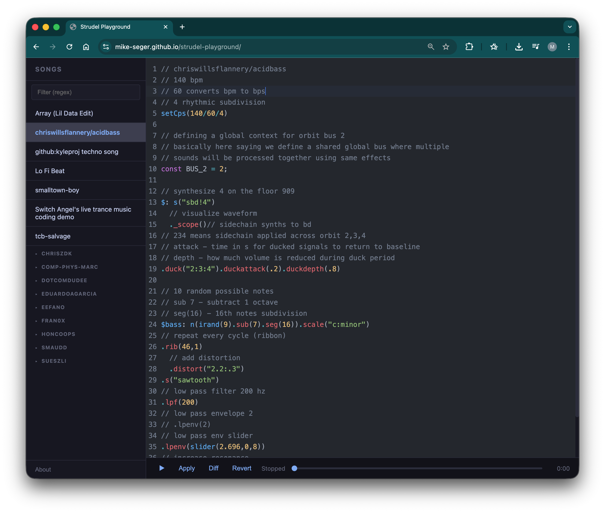

# Strudel Playground



A browser-based live-coding music playground built on [Strudel](https://strudel.cc/) with a CodeMirror 6 editor, dark theme, and a curated collection of songs.

## Features

- **Code editor** — CodeMirror 6 with JavaScript syntax highlighting and the One Dark theme
- **Song browser** — collapsible sidebar with songs organised by author/folder, regex filtering, and keyboard navigation
- **Playback controls** — play, pause, apply (hot-swap code while playing), diff, and revert
- **Progress bar** — elapsed time display with pause/resume support

## Getting Started

```bash
npm install
npm run dev
```

Open the URL printed by Vite (usually `http://localhost:5173`).

## How It Works

Songs live in `strudels/` as plain `.js` files containing Strudel patterns. A Vite plugin scans the directory recursively and auto-generates `strudels/index.js` so the sidebar stays in sync.

At runtime, `@strudel/repl@1.3.0` is loaded from unpkg and CodeMirror 6 from esm.sh via import maps — no build step is needed for the core app.

## Adding Songs

Drop a `.js` file into `strudels/` (or a subfolder for grouping). Add a `// @title My Song` comment in the first 10 lines to set the display name; otherwise the filename is used.

Restart the dev server (or let the file watcher pick it up) and the song appears in the sidebar.

## License

See [doc/code-license.md](doc/code-license.md).

## Documentation

Full documentation is available at [doc/index.html](doc/index.html).
